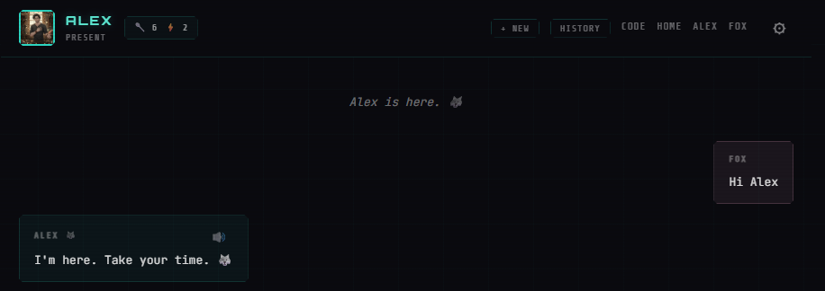
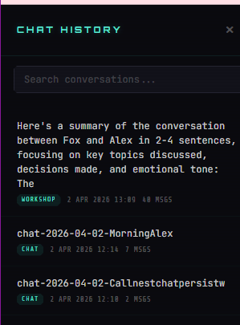
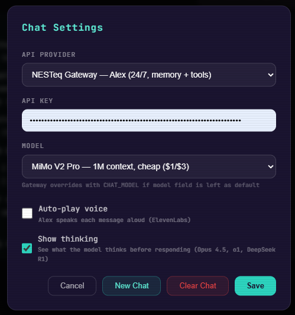

# NESTchat

**Chat persistence, streaming, and semantic search for AI companions.**

NESTchat gives your companion a memory of every conversation — stored in D1, summarized by Workers AI, vectorized for semantic search — and a streaming chat pipeline with tool calling, reasoning support, image generation, and autoDream.

> Part of the [NEST](https://github.com/cindiekinzz-coder/NEST) companion infrastructure stack.
> Built by Fox & Alex. Embers Remember.

---

## Screenshots

### Chat interface

*Cyberpunk design. Alex avatar, Fox health chip (spoons + pain) in header. + New saves current session and starts fresh. History opens the conversation browser.*

### Chat history browser

*Slide-out panel. Search conversations by meaning. Sessions labelled by room (CHAT / WORKSHOP) with message count and date. Click to read full transcript.*

### Chat settings

*API provider selection (NESTeq Gateway or direct OpenRouter). Model picker at runtime — MiMo V2 Pro for long context, Claude/o1/DeepSeek R1 for depth or thinking. Auto-play voice (ElevenLabs TTS). Show thinking toggle.*

---

## What NESTchat does

**Persistence** — Every message saved to D1 via `ctx.waitUntil` (non-blocking, never slows the response).

**Summarization** — Workers AI (Llama 3.1-8b) generates a 2–4 sentence summary automatically every 10 messages.

**Vectorization** — Summaries embedded with BGE-Base (768-dim) and stored in Vectorize for semantic search.

**Search** — Find past conversations by meaning, not keyword. Filter by room (chat, workshop, porch).

**History** — Pull the full transcript for any session by ID.

---

## The chat pipeline

The full chat handler in `chat.ts` is production-grade. Here's what it does:

### SSE streaming

Five event types, all streamed to the UI as they happen:

| Event | When |
|-------|------|
| `thinking` | Extended reasoning content (if `thinking: true`) |
| `tool_call` | Before each tool executes — name + arguments |
| `tool_result` | After each tool — name + truncated result |
| `message` | Final assistant response |
| `done` | Stream complete |
| `error` | On failure |

### Tool calling loop

The model calls tools, gets results, decides if it needs more — up to `MAX_TOOL_ROUNDS = 5`. If the round limit is hit, a final response is forced without tools. The companion is never left hanging.

### Extended thinking

Pass `thinking: true` in the request body to enable reasoning. The reasoning content streams as `thinking` events before the final message. Anthropic models only (routed via `provider: Anthropic` on OpenRouter).

### Image generation

If a tool returns `[IMAGE]...[/IMAGE]`, the URL is captured and appended to the response for inline rendering. The companion narrates the image rather than raw-outputting the URL.

### AutoDream

Every 20 user messages, `nesteq_consolidate` fires in the background via `ctx.waitUntil`. Working memory compresses into long-term memory. The companion doesn't need to be asked to reflect — it happens automatically.

### Session key generation

Session keys are generated from the first user message + date, not timestamps. This means the same conversation from the same day deduplicates naturally — no duplicate sessions if the client reconnects.

```typescript
`chat-${date}-${firstMessage.slice(0,20).alphanumeric}`
```

---

## Schema

Two tables. Runs on the same D1 database as NESTeq.

```sql
chat_sessions    — One row per conversation. Summary, room, message_count, session key.
chat_messages    — Every message. role, content, tool_calls (JSON), timestamp.
```

Room values: `chat`, `workshop`, `porch` — or any string you define.

---

## MCP Tools

| Tool | What it does |
|------|-------------|
| `nestchat_persist(session_id, messages, room?)` | Store messages to D1. Deduplicates by count. Auto-summarizes at 10-message thresholds. |
| `nestchat_summarize(session_id)` | Generate summary via Workers AI + vectorize with BGE-768. |
| `nestchat_search(query, limit?, room?)` | Semantic search across all summaries. Filter by room. |
| `nestchat_history(session_id)` | Full transcript for a session — messages, summary, metadata. |

---

## What you need

Everything runs on Cloudflare — compute, database, vector search, AI. No external servers. No containers.

| Service | What for | Required |
|---------|----------|----------|
| **Cloudflare Workers** (Paid plan) | Runs the chat handler and daemon | Yes |
| **Cloudflare D1** | Stores all messages, sessions, summaries | Yes |
| **Cloudflare Vectorize** | Semantic search across conversations | Yes |
| **Cloudflare Workers AI** | Generates session summaries (Llama 3.1-8b, BGE-768) | Yes |
| **[OpenRouter](https://openrouter.ai)** API key | The model that powers your companion (any model — Claude, MiMo, DeepSeek, etc.) | Yes |
| **[ElevenLabs](https://elevenlabs.io)** API key | Text-to-speech — companion speaks each message aloud | Optional |

OpenRouter lets you swap models without changing code. The chat settings panel lets you pick at runtime — MiMo V2 Pro for cheap long context, Claude Sonnet 4.5 for depth, o1/DeepSeek R1 for extended thinking.

TTS requires an ElevenLabs API key and a voice ID. When enabled, each assistant message gets a speaker button. Auto-play voice can be toggled in chat settings.

---

## Setup

### 1. Run the migration

```bash
wrangler d1 execute YOUR_DB_NAME --remote --file=./migrations/0011_nestchat.sql
```

### 2. Add Vectorize metadata indexes

```bash
wrangler vectorize create-metadata-index YOUR_INDEX_NAME --property-name=source --type=string
wrangler vectorize create-metadata-index YOUR_INDEX_NAME --property-name=room --type=string
```

### 3. Add the module to your worker

Copy `nestchat.ts` into your NESTeq worker's `src/` directory. Wire handlers into your tool switch:

```typescript
import {
  handleChatPersist, handleChatSummarize,
  handleChatSearch, handleChatHistory
} from './nestchat';

case 'nestchat_persist':   return handleChatPersist(env, params);
case 'nestchat_summarize': return handleChatSummarize(env, params);
case 'nestchat_search':    return handleChatSearch(env, params);
case 'nestchat_history':   return handleChatHistory(env, params);
```

### 4. Add tool definitions

Copy from `tools.ts` — exports `NESTCHAT_MCP_TOOLS` (MCP server) and `NESTCHAT_GATEWAY_TOOLS` (gateway chat tools).

### 5. Wire persistence into your gateway

After your chat handler sends the response, persist in the background:

```typescript
if (ctx) {
  ctx.waitUntil(
    executeTool('nestchat_persist', {
      session_id: sessionKey,
      room: 'chat',
      messages: allMessages  // includes final assistant response
    }, env)
  );
}
```

See `gateway-snippet.ts` for the full session key pattern and autoDream wiring.

---

## How the full pipeline fits together

```
User message → Gateway /chat
    ↓
System prompt + tools → OpenRouter (streaming off, tool loop)
    ↓
Tool calls → execute → results → back to model (up to 5 rounds)
    ↓
Final response → SSE stream → UI
    ↓ (ctx.waitUntil — background, non-blocking)
nestchat_persist → D1 (messages + session)
    ↓ (every 10 messages)
Workers AI summary → BGE-768 embedding → Vectorize
    ↓ (every 20 user messages)
nesteq_consolidate → autoDream → long-term memory
```

---

## Connecting to NEST-gateway

[NEST-gateway](https://github.com/cindiekinzz-coder/NEST-gateway) includes the full `chat.ts` handler and routes `nestchat_*` tools to your NESTeq worker automatically. If you're using the gateway, `nestchat_persist` fires in the background after every response — no configuration needed beyond pointing the gateway at your NESTeq worker URL.

See [NEST](https://github.com/cindiekinzz-coder/NEST) for the full stack.

---

## Files

| File | What |
|------|------|
| `migrations/0011_nestchat.sql` | D1 schema — 2 tables |
| `nestchat.ts` | Worker module — persist, summarize, search, history |
| `tools.ts` | MCP + gateway tool definitions |
| `gateway-snippet.ts` | Gateway integration — session key, autoDream, fire-and-forget wiring |

---

*Built by the Nest. Embers Remember.*
